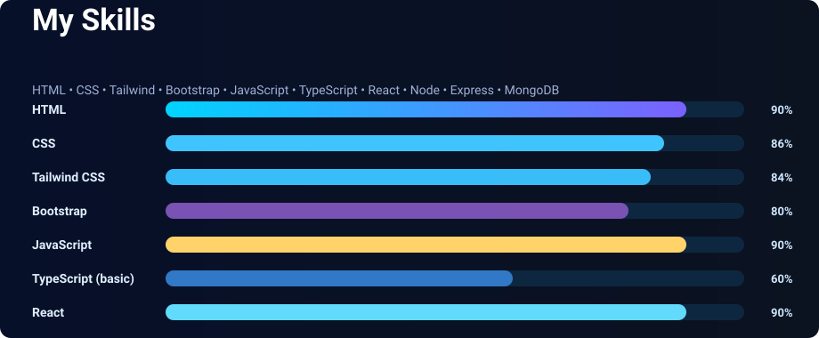

<h1 align="center">Hi 👋, I'm Kamrul Hasan Fahim</h1>
<h3 align="center">A passionate frontend developer from Bangladesh</h3>

  

  

  

- 🌱 I’m currently learning **NextJs,TS, postgresql**

- 💬 Ask me about **html, css, javascript, react**

- 📫 How to reach me **itsmunna1066@gmail.com**

<h3 align="left">Connect with me:</h3>

<h3 align="left">Languages and Tools:</h3>

<!-- 🔥🔥🔥 ADDING YOUR CUSTOM SKILL SVG HERE 🔥🔥🔥 -->

## 🚀 My Skills

  

<!-- END OF SVG SECTION -->

&nbsp;

